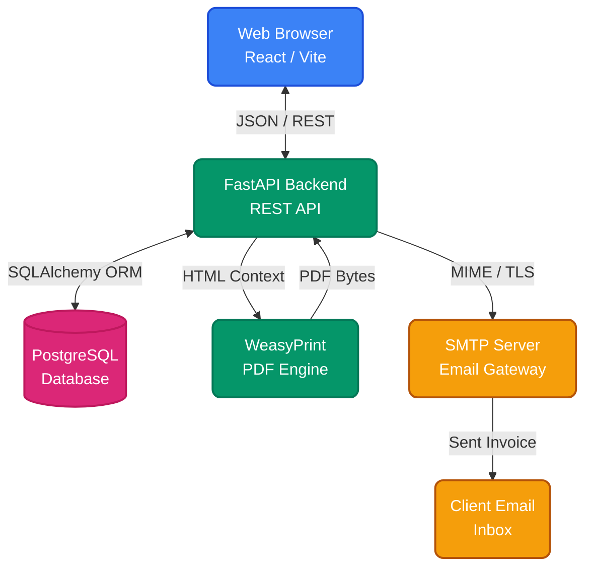

<div align="center">
  

  <h1>FFT Invoice Helper</h1>

  <p>
    <strong>Smart, Automated, and Professional Invoicing for Solar Providers</strong>
  </p>

  <p>
    <a href="#features">Features</a> •
    <a href="#architecture">Architecture</a> •
    <a href="#getting-started">Getting Started</a> •
    <a href="#deployment">Deployment</a>
  </p>

  <p>
    
    
    
    
    
  </p>
</div>

---

## 🚀 Overview

**FFT Invoice Helper** is a full-stack, containerized web application designed to streamline the invoicing process for solar installation professionals and contracting businesses. It provides a robust interface for managing clients, creating detailed invoices with dynamic rate calculations (e.g., Solar Panel Watts * Rate/W), and directly dispatching pixel-perfect HTML emails and PDF attachments securely.

## ✨ Features

- 💼 **Client Management:** Save recurring clients with specific contact and billing details for quick one-click invoice population.
- ⚡ **Solar-Specific Calculations:** Custom `solar_rate` item types automatically calculate line-item amounts based on Panel Count × Watts per Panel × Rate per Watt.
- 📄 **Professional PDF Generation:** Instantly generate clean, branded, and printable PDF invoices using server-side WeasyPrint HTML-to-PDF rendering.
- 📧 **Direct Email Integration:** Send beautifully formatted HTML invoices directly to clients via built-in secure SMTP integration, straight from the dashboard.
- 🎨 **Modern Dashboard:** Built on React and TailwindCSS (via customized CSS variables) offering a sleek, responsive, and intuitive user experience.
- 🐳 **Dockerized Deployment:** Fully containerized setup ensuring identical development and production environments.

## 🏗️ Architecture

The application follows a modern API-driven architecture, separating the React frontend from a high-performance Python FastAPI backend.



## 🛠️ Getting Started

### Prerequisites

- [Docker](https://docs.docker.com/get-docker/) & [Docker Compose](https://docs.docker.com/compose/install/)
- Node.js (for local non-docker frontend development)
- Python 3.12+ (for local non-docker backend development)

### Quick Start (Docker)

The fastest way to get the application running is using Docker Compose.

1. **Clone the repository:**
   ```bash
   git clone https://github.com/bkcsplayer/fft-invoice-helper.git
   cd fft-invoice-helper
   ```

2. **Configure Environment Variables:**
   ```bash
   cp .env.example .env
   # Edit .env with your specific SMTP and Database credentials
   ```

3. **Start the application:**
   ```bash
   docker-compose -f docker-compose.dev.yml up -d --build
   ```

4. **Access the application:**
   - Frontend UI: `http://localhost:5174`
   - Backend API Docs: `http://localhost:8001/docs`

> **Note:** The default login is `admin` / `1q2w3e4R` as configured in your local database seed or `.env` setup.

## 📂 Project Structure

```text
fft-invoice-helper/
├── backend/                  # FastAPI Python application
│   ├── app/                  # Main application code
│   │   ├── api/              # Route handlers
│   │   ├── core/             # Security and config
│   │   ├── models/           # SQLAlchemy ORM definitions
│   │   ├── services/         # Business logic (PDF, Email)
│   │   └── templates/        # Jinja2 HTML templates for invoices
│   ├── requirements.txt      # Python dependencies
│   └── Dockerfile.dev        # Backend Docker configuration
├── frontend/                 # React frontend application
│   ├── src/                  # Source code
│   │   ├── components/       # Reusable UI components
│   │   ├── pages/            # View pages (Dashboard, Invoice Form)
│   │   └── api/              # Axios API bindings
│   ├── package.json          # Node dependencies
│   └── vite.config.js        # Vite build configuration
├── docker-compose.dev.yml    # Development orchestration
└── .env.example              # Environment variable template
```

## ⚙️ SMTP Email Configuration

To enable the direct email functionality, configure the following variables in your `.env` file:

```env
SMTP_HOST=smtp.gmail.com
SMTP_PORT=587
SMTP_USERNAME=your-email@gmail.com
SMTP_PASSWORD=your-app-specific-password
SMTP_USE_TLS=true
SMTP_FROM_EMAIL=your-email@gmail.com
SMTP_FROM_NAME="Your Name or Company"
```

## 📄 License

Proprietary Software. Internal Use Only by FutureFrontier Technology Ltd. and authorized personnel.

---
<div align="center">
  <i>Developed with precision for FutureFrontier Technology</i>
</div>
